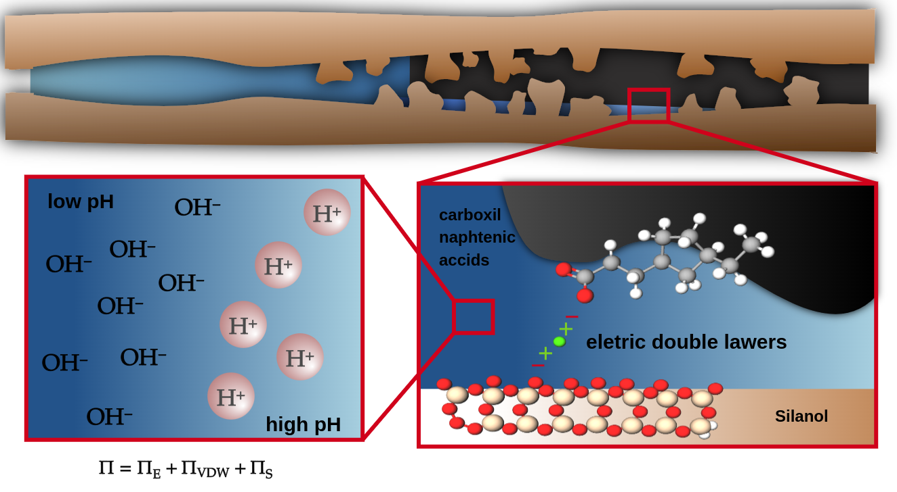

# SBPMat-Results-main-

## The figure bellow discribes 

Fig.1 - Effect of low salinity in oil/brine/rock interface in molecular scale

Este repositório é dedicado ao estudo e análise da interação em escala molecular entre óleo, salmoura e rocha em condições de baixa salinidade. Utilizamos uma combinação de Jupyter Notebooks, Python, Gnuplot e Shell para realizar simulações, processar dados e criar visualizações.

## Conteúdo do Repositório

O repositório contém os seguintes diretórios e arquivos importantes:

- `.ipynb_checkpoints`: Este diretório contém checkpoints para os nossos Jupyter notebooks.
- `Convercao_de_Unidades`: Este diretório contém scripts ou notebooks relacionados à conversão de unidades usadas em nossas simulações.
- `Geometries`: Este diretório contém informações ou arquivos relacionados à geometria dos sistemas que estamos estudando.
- `Gifs_TEste`: Este diretório contém GIFs ou visualizações animadas de nossas simulações ou resultados.
- `R-1, R-2, R-3, R-4, R-5`: Estes diretórios podem conter resultados ou dados de diferentes rodadas ou variações de nossas simulações.
- `Resultados`: Este diretório contém os resultados finais ou sumarizados de nossas simulações.
- `AnguloContato.png`, `AnguloMethod.png`, `ContactAngle.png`: Estas são imagens que representam os ângulos de contato em nossas simulações ou experimentos.
- `Makefiles.sh`: Este é um script shell para compilar ou executar nossos programas ou scripts.
- `Sistema.png`, `System.jpg`: Estas são imagens que representam o sistema que estamos estudando.
- `circ1`, `square1`: Estes arquivos podem conter dados, scripts ou resultados específicos.
- `gitpush.sh`: Este é um script shell para facilitar o processo de commit e push para este repositório.

## Como Usar Este Repositório

Para usar este repositório, você pode cloná-lo em sua máquina local e executar os Jupyter notebooks ou scripts conforme necessário. Certifique-se de ter as dependências necessárias instaladas, incluindo Jupyter, Python, Gnuplot e qualquer pacote Python necessário.

## Contribuições

Contribuições para este repositório são bem-vindas. Por favor, abra um issue para discutir quaisquer alterações ou melhorias que você gostaria de propor.
